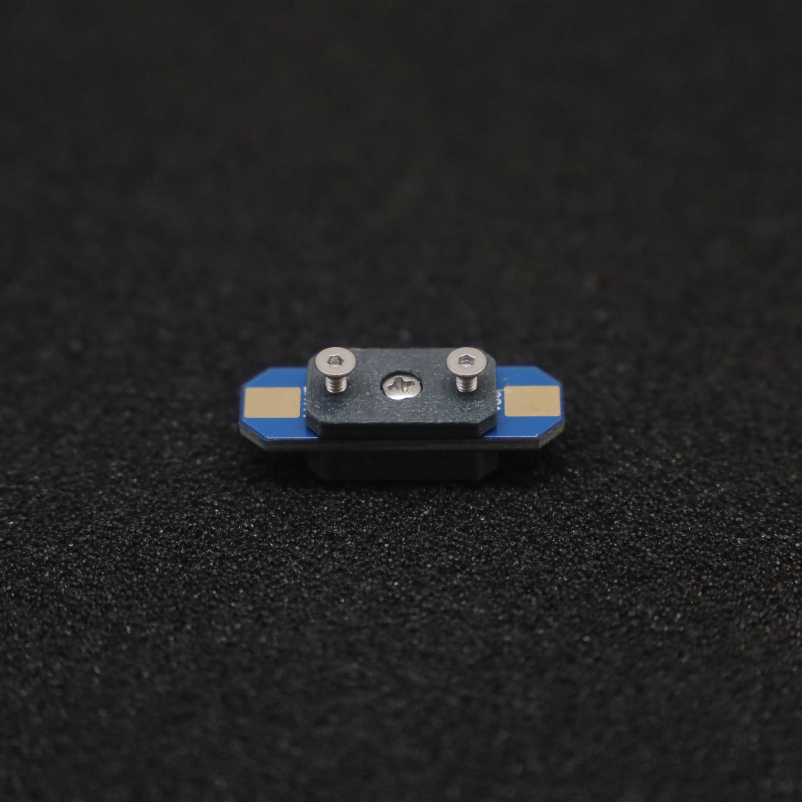
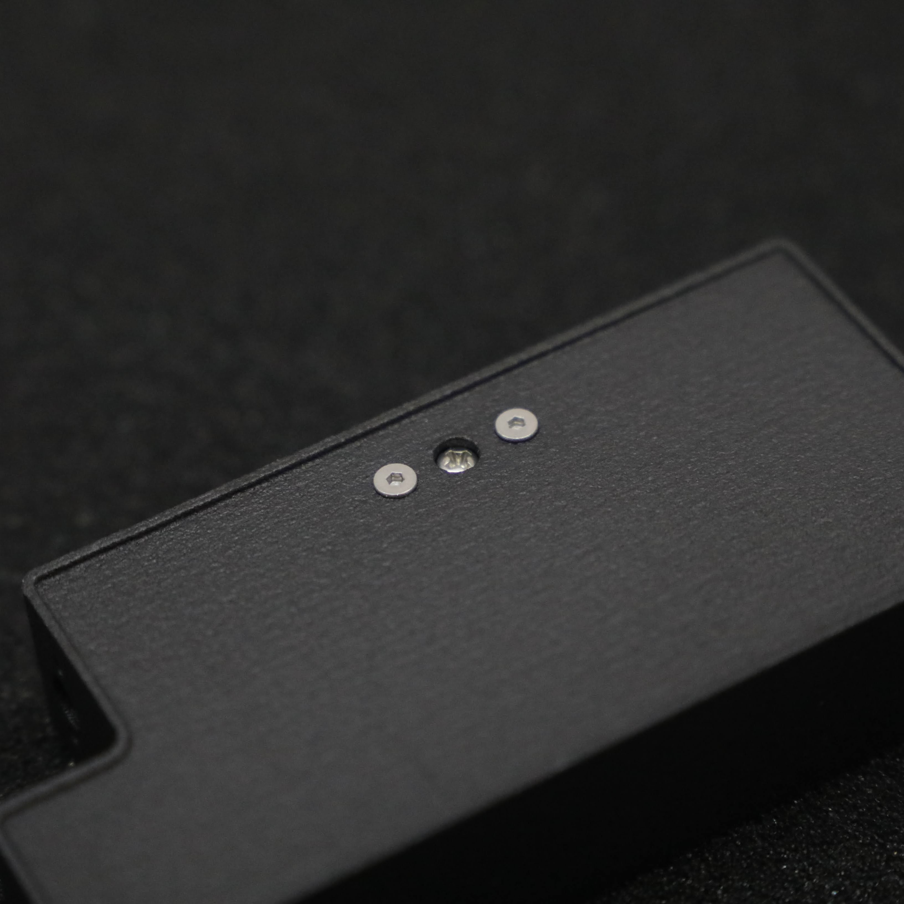
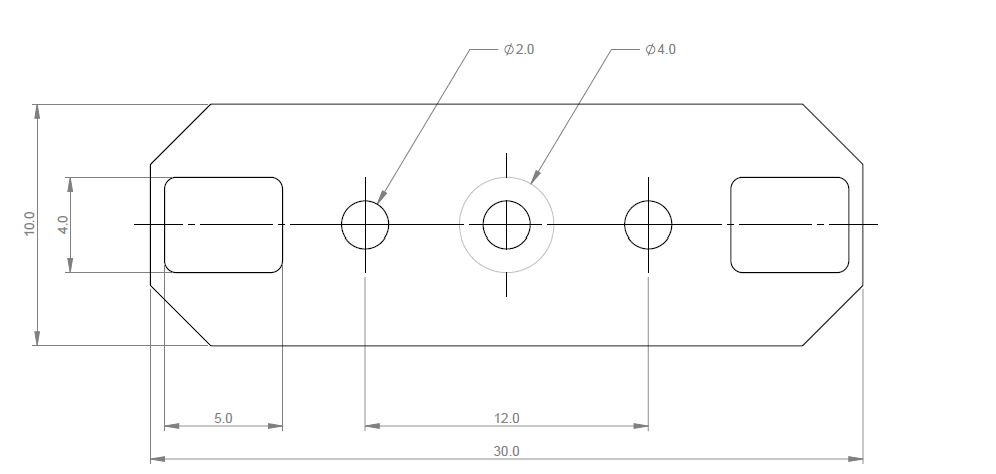
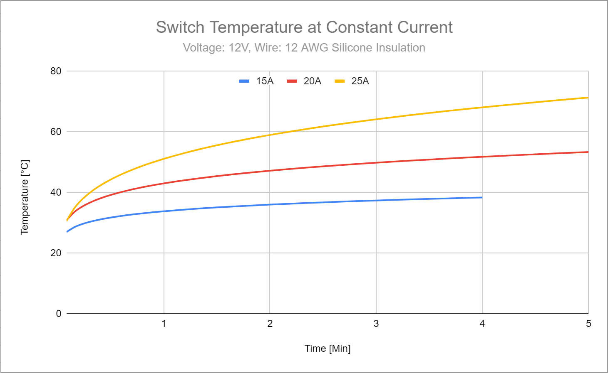

# TWIST SWITCH v1.0

   

TWIST SWITCH is a light-weight vibration-resistant power switch: originally designed for combat robotics, but it's suitable for any application that requires small form-factor power switch. 

Designed and built in [Christchurch, New Zealand ](https://www.google.co.nz/maps/place/Christchurch+New+Zealand) by Connor Benton, visit [cb-technology](https://www.cb-technology.co.nz/) for details.

## SPECIFICATIONS

- **Continuious Current - Rated:** 20A *(for more infomation see the Current Rating seciton)*
- **Continuious Current - Max:** 25A
- **Voltage Drop:** 0.5 V  *(at 12V, 20A)*
- **Dimensions:** 10x30x7 mm
- **Weight:** 2g *excluding wires*
- **Power and Mounting Screw:** M2 

## Installation

1. Drill the holes as per the provided hole pattern: 
2. Testfit the TWIST SWITCH, checking for correct alignment and accessability prior to soldering the wires.
3. Solder the battery wires to the mounting pads.
   - The positive wires should be soldered to the topside. These pads are labelled +BATT and VCC for the battery and electronics connections respectively. 
   - The negative wires do not NEED to be soldered to the switch, although pass-through pads are provided on the underside to simplify cable management.
4. Mount the switch using the provided mounting hardware.
   - The kit allows for mounting onto pannels up to 3mm thick. Mounting to thicker pannels requires the user to procure additional longer M2 fasteners.
   - Take care not to overtighten the mount fasteners when installing: overtightenting can cause damage to the switch which will impact performance.

  
## Operation

###### Turning ON

1. Verify the power screw is in the OFF position
2. Connect the battery 
3. Using a screw driver, tightening the center (power) screw clockwise until it makes a good connection with the pads below. 
   - It does not take much force to make a good connection: approximately 0.4[Nm] ≈ finger tight.
5. Smash some bot! 

###### Turning OFF

1. Turn the power screw counter-clockwise until your Power LED de-illuminates.
   - It should only take a 1/4 turn to disconnect the power, although it is recommended to back the screw out one full rotation.

## Current Rating
The actual current that the switch can handle is determined by its temperature during operation; which is  **very** dependednt on the wires (gauge, length, and insulation) and avalible cooling. As use cases for this switch vary drastically, it is up the the user to spec and test the wires for their given application. 

As a guide, a constant-current thermal test has been conducted to illistrate the switches thermal characteristics. 
Note: This test has been conducted at constant current, resulting in a higher temperature than the pulse currents in many applications. 

